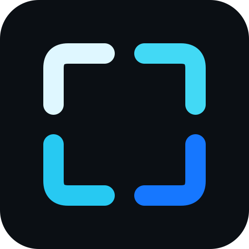

# BorderlessMC

<p align="center">
  
</p>

[!\[Build](https://img.shields.io/github/actions/workflow/status/Wolffsohn-Interactive/BorderlessMC/build.yml?label=build\&logo=github)](https://github.com/Wolffsohn-Interactive/BorderlessMC/actions/workflows/build.yml)
[!\[Minecraft](https://img.shields.io/badge/Minecraft-multi--version-62B47A)](https://www.minecraft.net/)
[!\[License: PolyForm Shield 1.0.0](https://img.shields.io/badge/License-PolyForm%20Shield%201.0.0-blue.svg)](LICENSE.md)
[!\[GitHub](https://img.shields.io/badge/GitHub-Repository-181717?logo=github)](https://github.com/Wolffsohn-Interactive/BorderlessMC)
[!\[Modrinth](https://img.shields.io/badge/Modrinth-Project-00AF5C?logo=modrinth)](https://modrinth.com/project/borderlessmc-mod)

**BorderlessMC** is a client-side Minecraft mod that lets you play in a borderless fullscreen window while still being able to interact with other applications and displays.

## Supported Minecraft Versions

BorderlessMC is designed as a single project with separate Minecraft-version modules.

|Minecraft|Status|Build module|
|-|-|-|
|26.3|Available|`versions/mc26.3`|
|26.2|Available|`versions/mc26.2`|
|26.1.2|Available|`versions/mc26.1.2`|
|26.1.1|Available|`versions/mc26.1.1`|
|26.1|Available|`versions/mc26.1`|

New Minecraft versions will be added under the same BorderlessMC repository instead of creating a separate repository for each game version.

## Features

* Borderless fullscreen
* Multiple fullscreen modes
* Multi-monitor support
* Configurable fullscreen behavior
* Fabric, Quilt, NeoForge, and Forge support from the same version-specific JAR
* Sodium, Mod Menu, YACL, and Cloth Config compatibility where supported
* Windows, Linux, and macOS support
* `--borderless` startup option

## Usage

Open Minecraft's video settings and switch the fullscreen setting to `Borderless`.

You can also start Minecraft with `--borderless` to force BorderlessMC to launch in borderless fullscreen mode.

## Releases

Download the latest release from [GitHub Releases](https://github.com/Wolffsohn-Interactive/BorderlessMC/releases) or [Modrinth](https://modrinth.com/project/borderlessmc-mod).

For Minecraft 26.1, 26.1.1, 26.1.2, 26.2, or 26.3, download the JAR matching your Minecraft version and place it in your `mods` folder. The same version-specific JAR supports Fabric, Quilt, NeoForge, and Forge.

Release packages identify both the BorderlessMC release and the Minecraft version they target.

For example:

```
BorderlessMC-26.10.07+26.3.jar
```

The `26.10.07` portion identifies the BorderlessMC release, while `26.3` identifies the Minecraft target.

## Building

The root project is an umbrella project. Each Minecraft version is a separate Gradle module.

For Minecraft 26.3 on Windows:

```powershell
.\\gradlew.bat :versions:mc26\_3:build
```

For Minecraft 26.2 on Windows:

```powershell
.\\gradlew.bat :versions:mc26\_2:build
```

For Minecraft 26.1.2 on Windows:

```powershell
.\\gradlew.bat :versions:mc26\_1\_2:build
```

For Minecraft 26.1.1 on Windows:

```powershell
.\\gradlew.bat :versions:mc26\_1\_1:build
```

For Minecraft 26.1 on Windows:

```powershell
.\\gradlew.bat :versions:mc26\_1:build
```

To build every currently configured Minecraft version on Windows:

```powershell
.\\gradlew.bat build
```

On Linux or macOS, use the Gradle wrapper:

```bash
./gradlew build
```

Build output is produced inside the corresponding version module's `build\\libs` directory.

## Project Structure

```
BorderlessMC/
├── src/
│   └── main/
│       ├── java/
│       └── resources/
├── versions/
│   ├── mc26.1/
│   │   └── build.gradle.kts
│   ├── mc26.1.1/
│   │   └── build.gradle.kts
│   ├── mc26.1.2/
│   │   └── build.gradle.kts
│   ├── mc26.2/
│   │   └── build.gradle.kts
│   └── mc26.3/
│       └── build.gradle.kts
├── build.gradle.kts
├── settings.gradle.kts
└── README.md
```

The repository is intentionally organized around Minecraft versions so that different Minecraft releases can coexist without turning each version into a separate project.

## License

BorderlessMC is licensed under the [PolyForm Shield License 1.0.0](LICENSE.md).

Required Notice: Copyright 2026 ValiantGiant985

